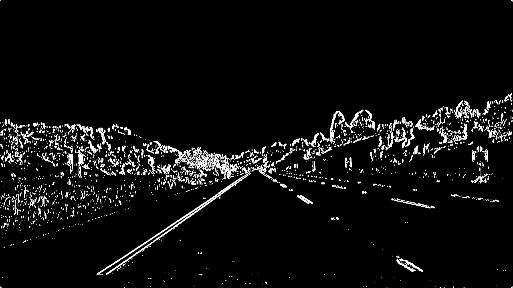
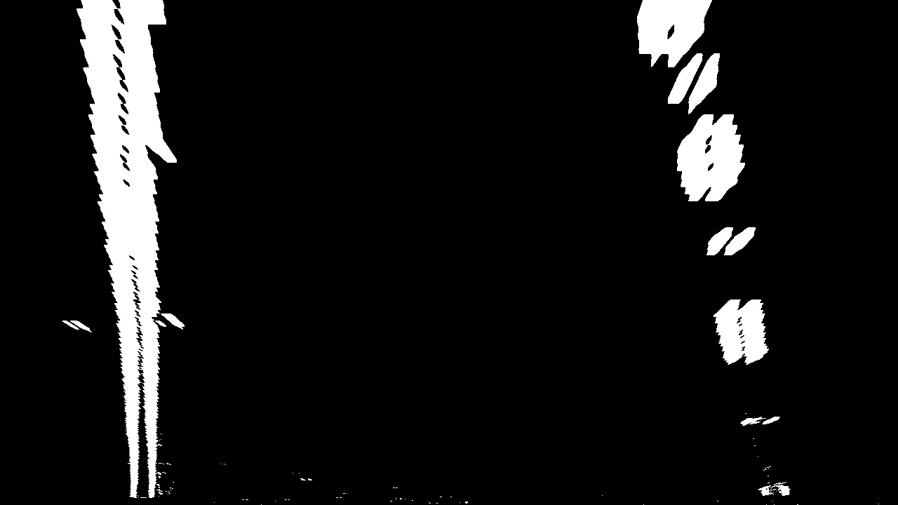
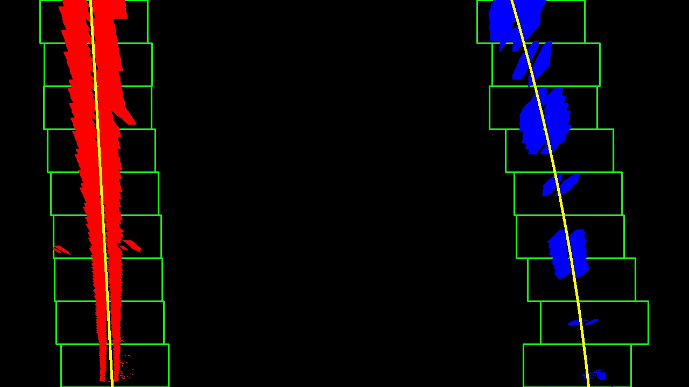

**Advanced Lane Finding Project**

The goals / steps of this project are the following:

* Compute the camera calibration matrix and distortion coefficients given a set of chessboard images.
* Apply a distortion correction to raw images.
* Use color transforms, gradients, etc., to create a thresholded binary image.
* Apply a perspective transform to rectify binary image ("birds-eye view").
* Detect lane pixels and fit to find the lane boundary.
* Determine the curvature of the lane and vehicle position with respect to center.
* Warp the detected lane boundaries back onto the original image.
* Output visual display of the lane boundaries and numerical estimation of lane curvature and vehicle position.

[//]: # (Image References)

[image1]: ./examples/undistort_output.png "Undistorted"
[image2]: ./test_images/test1.jpg "Road Transformed"
[image3]: ./examples/binary_combo_example.jpg "Binary Example"
[image4]: ./examples/warped_straight_lines.jpg "Warp Example"
[image5]: ./examples/color_fit_lines.jpg "Fit Visual"
[image6]: ./examples/example_output.jpg "Output"
[video1]: ./project_video.mp4 "Video"

## [Rubric](https://review.udacity.com/#!/rubrics/571/view) Points

### Here I will consider the rubric points individually and describe how I addressed each point in my implementation.  

---

### Writeup / README

### Camera Calibration

#### 1. Briefly state how you computed the camera matrix and distortion coefficients. Provide an example of a distortion corrected calibration image.

The code for this step is contained in the IPython notebook located in [./work/camera_cal.ipynb](./work/camera_cal.ipynb)" 

I start by preparing "object points", which will be the (x, y, z) coordinates of the chessboard corners in the world. Here I am assuming the chessboard is fixed on the (x, y) plane at z=0, such that the object points are the same for each calibration image.  Thus, `objp` is just a replicated array of coordinates, and `objpoints` will be appended with a copy of it every time I successfully detect all chessboard corners in a test image.  `imgpoints` will be appended with the (x, y) pixel position of each of the corners in the image plane with each successful chessboard detection.  

I then used the output `objpoints` and `imgpoints` to compute the camera calibration and distortion coefficients using the `cv2.calibrateCamera()` function.  I applied this distortion correction to the test image using the `cv2.undistort()` function.  

One of the obtained results is as follows

|case|before undistorted|after undistorted|
|-|-|-|
|caliobration1.jpg||   |

You can see all the results [here](doc/camera_cal_results.md). 

### Pipeline (single images)

#### 1. Provide an example of a distortion-corrected image.

The code for undistorion is in section 'Undistort' in  [./work/work.ipynb](./work/work.ipynb)
Following is one example from the `test_images`. 

|case|before undistorted|after undistorted|
|-|-|-|
|straight_lines1.jpg||   |

You can see all the result [here](doc/undistort_results.md). 

#### 2. Describe how (and identify where in your code) you used color transforms, gradients or other methods to create a thresholded binary image.  Provide an example of a binary image result.

The code for undistorion is in section 'Make binary image' in  [./work/work.ipynb](./work/work.ipynb)

I used a combination of color and gradient threshold to generate binary image. 

For the gradient, I used following parameters for sobel operator. 

```
sobel_thresh_min = 20
sobel_thresh_max = 220
sobel_kernel_size = 7
```

For color, I used following parameters as the threshold. 

```
s_thresh_min = 170
s_thresh_max = 230
```

Following is one example from the `test_images`. 

|case|before|after|
|-|-|-|
|straight_lines1.jpg||   |

You can see all the result [here](doc/binary_results.md). 

#### 3. Describe how (and identify where in your code) you performed a perspective transform and provide an example of a transformed image.

The code for undistorion is in section 'Make perspective image' in  [./work/work.ipynb](./work/work.ipynb)
The function I defined is `make_perspective_image()`. 

I hardcoded the src and dst in the code as follows. 

```python
    src = np.float32([[200, 720],  [600, 450], [700, 450], [1100, 720]])
    dst = np.float32([[200, 720],  [200,   0], [1100,   0], [1100, 720]])
```

I verified that my perspective transform was working as expected by drawing the `src` and `dst` points onto a test image and its warped counterpart to verify that the lines appear parallel in the warped image.

Following is one example from the `test_images`. 

|case|before|after|
|-|-|-|
|straight_lines1.jpg||   |

You can see all the result [here](doc/perspective_results.md). 

The result for `straight_lines1.jpg` seemingly not straight lines. However, from the final resuls, I judged it is still ok in this step. 

In addition, it is very difficult to make this image as straight line with keep other images meaningful, i.e. having lane line inside the perspective image. 


#### 4. Describe how (and identify where in your code) you identified lane-line pixels and fit their positions with a polynomial?

The code for undistorion is in section 'Fit Polynomial' in  [./work/work.ipynb](./work/work.ipynb)
The function I defined is `make_polyfit_image()`.  Inside the function, I did window search and fitting with 2nd order polynomial as introduced in the course. 

Here, I did not make tuning because the final results is clearly acceptable. 

Following is one example from the `test_images`. 

|case|before|after|
|-|-|-|
|straight_lines1.jpg||   |

You can see all the result [here](doc/polyfit_images.md). 

#### 5. Describe how (and identify where in your code) you calculated the radius of curvature of the lane and the position of the vehicle with respect to center.

I did this in lines # through # in my code in `my_other_file.py`

#### 6. Provide an example image of your result plotted back down onto the road such that the lane area is identified clearly.

I implemented this step in lines # through # in my code in `yet_another_file.py` in the function `map_lane()`.  Here is an example of my result on a test image:

![alt text][image6]

---

### Pipeline (video)

#### 1. Provide a link to your final video output.  Your pipeline should perform reasonably well on the entire project video (wobbly lines are ok but no catastrophic failures that would cause the car to drive off the road!).

Here's a [link to my video result](./project_video.mp4)

---

### Discussion

#### 1. Briefly discuss any problems / issues you faced in your implementation of this project.  Where will your pipeline likely fail?  What could you do to make it more robust?

Here I'll talk about the approach I took, what techniques I used, what worked and why, where the pipeline might fail and how I might improve it if I were going to pursue this project further.  
