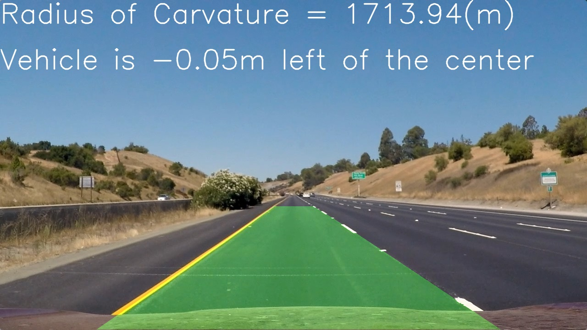

**Advanced Lane Finding Project**

The goals / steps of this project are the following:

* Compute the camera calibration matrix and distortion coefficients given a set of chessboard images.
* Apply a distortion correction to raw images.
* Use color transforms, gradients, etc., to create a thresholded binary image.
* Apply a perspective transform to rectify binary image ("birds-eye view").
* Detect lane pixels and fit to find the lane boundary.
* Determine the curvature of the lane and vehicle position with respect to center.
* Warp the detected lane boundaries back onto the original image.
* Output visual display of the lane boundaries and numerical estimation of lane curvature and vehicle position.

### Here I will consider the rubric points individually and describe how I addressed each point in my implementation.  

---

### Camera Calibration

#### 1. Briefly state how you computed the camera matrix and distortion coefficients. Provide an example of a distortion corrected calibration image.

The code for this step is contained in the IPython notebook located in [./work/camera_cal.ipynb](./work/camera_cal.ipynb)" 

I start by preparing "object points", which will be the (x, y, z) coordinates of the chessboard corners in the world. Here I am assuming the chessboard is fixed on the (x, y) plane at z=0, such that the object points are the same for each calibration image.  Thus, `objp` is just a replicated array of coordinates, and `objpoints` will be appended with a copy of it every time I successfully detect all chessboard corners in a test image.  `imgpoints` will be appended with the (x, y) pixel position of each of the corners in the image plane with each successful chessboard detection.  

I then used the output `objpoints` and `imgpoints` to compute the camera calibration and distortion coefficients using the `cv2.calibrateCamera()` function.  I applied this distortion correction to the test image using the `cv2.undistort()` function.  

One of the obtained results is as follows

|case|before undistorted|after undistorted|
|-|-|-|
|caliobration1.jpg||   |

You can see all the results [here](doc/camera_cal_results.md). 

### Pipeline (single images)

#### 1. Distortion Correction

The code for undistorion is in section 'Undistort' in  [./work/work.ipynb](./work/work.ipynb)
Following is one example from the `test_images`. 

|case|before undistorted|after undistorted|
|-|-|-|
|straight_lines1.jpg||   |

You can see all the result [here](doc/undistort_results.md). 

#### 2. Make binary image

The code for making binary image is in section 'Make binary image' in  [./work/work.ipynb](./work/work.ipynb)

I used a combination of color and gradient threshold to generate binary image. 

For the gradient, I used following parameters for sobel operator. 

```
sobel_thresh_min = 20
sobel_thresh_max = 220
sobel_kernel_size = 7
```

For color, I used following parameters as the threshold. 

```
s_thresh_min = 170
s_thresh_max = 230
```

Following is one example from the `test_images`. 

|case|before|after|
|-|-|-|
|straight_lines1.jpg||   |

You can see all the result [here](doc/binary_results.md). 

#### 3. Make perspective image

The code for makeing perspective image is in section 'Make perspective image' in  [./work/work.ipynb](./work/work.ipynb)
The function I defined is `make_perspective_image()`. 

I hardcoded the src and dst in the code as follows. 

```python
    src = np.float32([[200, 720],  [600, 450], [700, 450], [1100, 720]])
    dst = np.float32([[200, 720],  [200,   0], [1100,   0], [1100, 720]])
```

I verified that my perspective transform was working as expected by drawing the `src` and `dst` points onto a test image and its warped counterpart to verify that the lines appear parallel in the warped image.

Following is one example from the `test_images`. 

|case|before|after|
|-|-|-|
|straight_lines1.jpg||   |

You can see all the result [here](doc/perspective_results.md). 

The result for `straight_lines1.jpg` seemingly not straight lines. However, from the final resuls, I judged it is still ok in this step. 

In addition, it is very difficult to make this image as straight line with keep other images meaningful, i.e. having lane line inside the perspective image. 


#### 4. make polynomial fitting

The code for polynomial fitting is in section 'Fit Polynomial' in  [./work/work.ipynb](./work/work.ipynb)
The function I defined is `make_polyfit_image()`.  Inside the function, I did window search and fitting with 2nd order polynomial as introduced in the course. 

Here, I did not make tuning because the final results is clearly acceptable. 

Following is one example from the `test_images`. 

|case|before|after|
|-|-|-|
|straight_lines1.jpg||   |

You can see all the result [here](doc/polyfit_images.md). 

#### 5. calculate curvature

The code for calculating curvature is in section 'Measure Curvature' in  [./work/work.ipynb](./work/work.ipynb)

Here, I used 3rd order polynomial to compute curvature since 2nd order polynomial made a goot result. The result from 2nd order polynomial shows 80000 [m].  The 3rd order polynomial shows better result than the 2nd order polynomial. 

Curvature is computed as following equation which is derived from the definition of the curvature

```python
curvature = (1 + (3 * fit_cr[0]  * y_eval ** 2 + 2 * fit_cr[1] * y_eval + fit_cr[2]) ** 2) ** 1.5 / np.absolute(6 * fit_cr[0] * y_eval + 2 * fit_cr[1]) 
```

I used `xm_per_pix = 3.7/900` since I perspected left lane at 200 and right lane at 1100. 

The first shows the file of image, the second shows the left line curvature, and the third shows the right curvature. 

```
../test_images/straight_lines1.jpg left_curvature = 1713.936 [m], right_curvature = 656.750 [m]
../test_images/straight_lines2.jpg left_curvature = 1432.029 [m], right_curvature = 1320.389 [m]
../test_images/test1.jpg left_curvature = 217.077 [m], right_curvature = 252.190 [m]
../test_images/test2.jpg left_curvature = 192.637 [m], right_curvature = 130.205 [m]
../test_images/test3.jpg left_curvature = 339.424 [m], right_curvature = 189.341 [m]
../test_images/test4.jpg left_curvature = 116.079 [m], right_curvature = 2840.492 [m]
../test_images/test5.jpg left_curvature = 349.368 [m], right_curvature = 477.523 [m]
../test_images/test6.jpg left_curvature = 168.173 [m], right_curvature = 131.019 [m]
```


#### 6. Drawing back down on to the road

The code for drawing back down on to the road is in section 'Drawing' in  [./work/work.ipynb](./work/work.ipynb)

A function `create_final_image(img, warped, left_fitx, right_fitx, Minv, left_curvature)` makes drawn image.

The fist argument is the original image. The second one is wrapped images with polyfit line. The third and fourth is polygitted x coordinates of left and right lanes. They are used to compute offset of the vehicle. Minv is used to compute inverse perspectrive. 
The last argument is used to plot curvature of lane. 

Following is one example from the `test_images`. 

|case|before|after|
|-|-|-|
|straight_lines1.jpg||   |

You can see all the result [here](doc/final_results.md). 


---

### Pipeline (video)

#### 1. Pipelined video

The code pipelining all the process is in section 'Pipeline' in  [./work/work.ipynb](./work/work.ipynb)

`process_image(img):` compute all the process that I had shown. 

Here's a [link to my video result](output_videos/project_video.mp4)

---

### Discussion

Here I'll talk about problems what I faced with the project. 

#### Lots of parameters 
The pipline has a lots of parameters for tuning. In the current project, the scene is only highway with sunny and daylight. 

Pipline with the parameter may make bad result if the condition of ther road or time changes. 

#### Processing time 
Current pipline shows about 1 sec to make results. In the real world, 1 sec is too slow to detect edge. 
I also tried `Skip the sliding windows step once you've found the lines` introduced in lectures. But it doesn't improve the performance. 

I can improve the performance by dropping some step, e.g. only use color or only use gradient, to speedup processing time, make speedup.  However, we should consider trade-off between the precision of the result and throughput of detection. 

#### Hypothesis case to be failed
In the perspective step, I assumed that the left lane is on 200, and the right one is on 1100 at the bottom of the image. If this assumption is wrong, the result of the lane line detection may fail. 

Self detection of the position at the bottom of the image may improve the result. 

2nd order polynomial may be faiiled if the lane line has two curves like `harder_challenge_video.mp4`. 3rd order polynomial or another equation to represent lane line is required.
